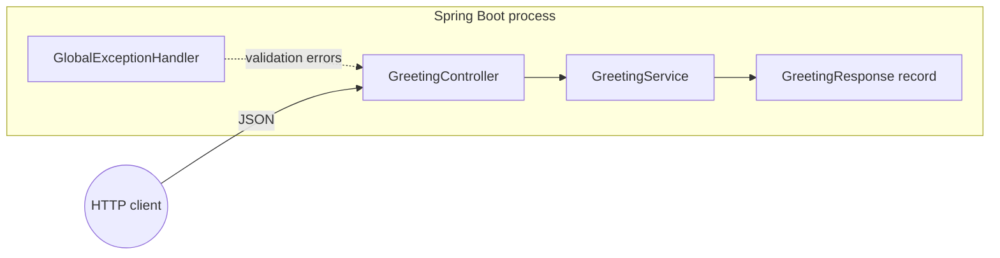

# High-level design (HLD)

## 1. Purpose and scope

The **AI-Driven Greeting API** is a minimal, **stateless** HTTP service that returns structured greetings. It exists as a **reference implementation** for:

- Modern Java (**25 LTS**) with **virtual threads** (Project Loom).
- **Spring Boot 3.4** with constructor injection, validation, **RFC 7807** errors, and **Actuator** observability.
- **AI-assisted development**: governance files and this documentation tree keep humans and coding agents aligned.

The system does not persist data and scales horizontally behind any load balancer or orchestrator.

## 2. Quality attributes

| Attribute | Approach |
|-----------|----------|
| **Scalability** | Stateless API; virtual threads for high fan-out I/O. |
| **Operability** | Actuator health (including liveness/readiness groups), Prometheus metrics, JSON logs with trace correlation. |
| **Maintainability** | Records for DTOs, thin controllers, dedicated exception handling, OpenAPI (Swagger UI). |
| **Security** | Non-root container, input validation, global error shape without stack traces in API responses. |

## 3. Documentation map

| Topic | Document |
|--------|----------|
| C4 views | [c4-model.md](c4-model.md) |
| Request flows | [sequence-diagrams.md](sequence-diagrams.md) |
| API and domain rules | [fdd-greeting-service.md](fdd-greeting-service.md) |
| Coding standards and tests | [engineering.md](engineering.md) |
| Threats and mitigations | [security.md](security.md) |
| Metrics and logs | [../ops/observability.md](../ops/observability.md) |
| ADR — stack | [../adr/0001-stack-and-patterns.md](../adr/0001-stack-and-patterns.md) |
| ADR — OpenAPI | [../adr/0002-openapi-documentation.md](../adr/0002-openapi-documentation.md) |
| ADR — observability | [../adr/0003-observability-logging-tracing.md](../adr/0003-observability-logging-tracing.md) |
| ADR — Docker image | [../adr/0004-container-image-docker.md](../adr/0004-container-image-docker.md) |
| AI workflow | [../ai/governance.md](../ai/governance.md) |

## 4. Technical pillars

- **Java 25 and records:** Immutable DTOs by default; low ceremony data carriers.
- **Virtual threads:** Platform threads are not the scalability bottleneck for typical I/O-bound REST workloads; enable via configuration.
- **Cloud-native operations:** Configuration via environment variables, JSON logs, Kubernetes-friendly health probes.
- **Governance as code:** `CLAUDE.md`, `.cursorrules`, and `docs/` act as **signals** so automated tools preserve architecture and naming.

## 5. Logical view (layered)

The HTTP adapter delegates to a small domain-oriented service. Infrastructure concerns (validation filters, observation, logging) are framework-managed.

For deployable units and internal components, see [c4-model.md](c4-model.md).
