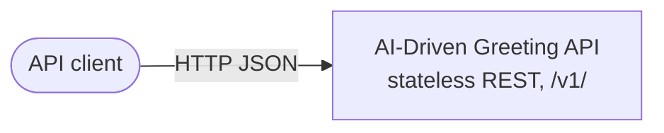
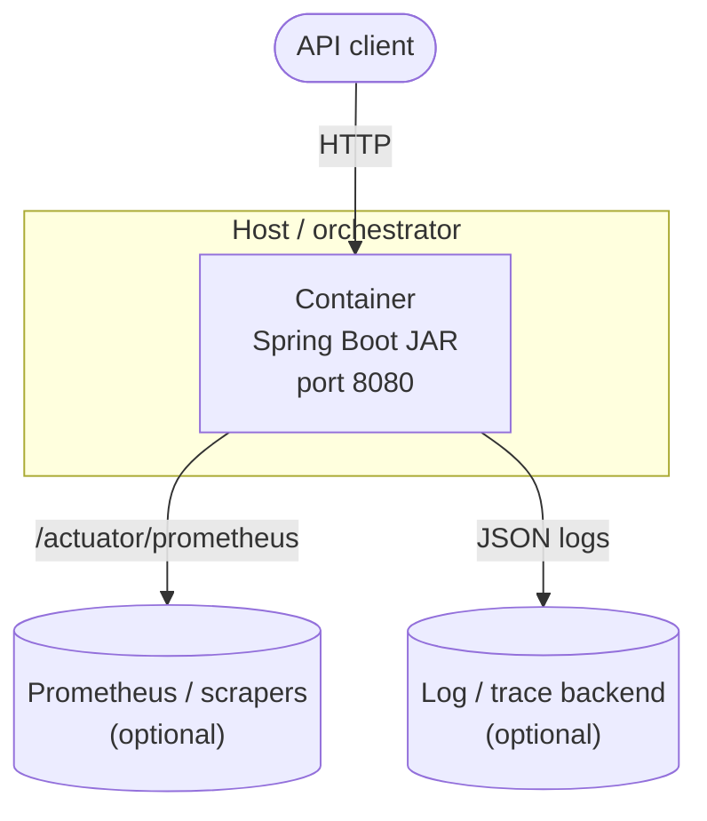
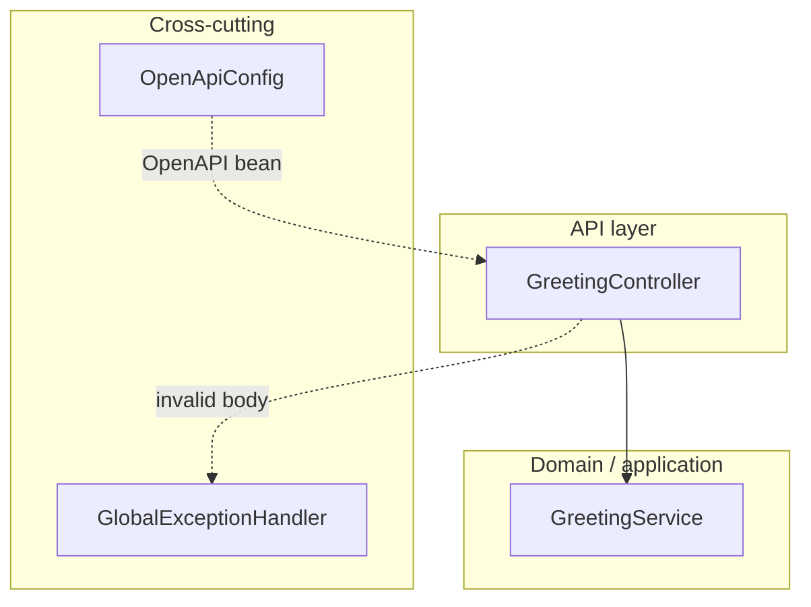

# C4 model

[C4](https://c4model.com/) provides a hierarchy of **context**, **container**, **component**, and (optionally) **code** diagrams. This project uses **Mermaid** for portability.

---

## Level 1 — System context

Shows the system boundary and its primary user. (Rendered with core Mermaid for maximum tool compatibility.)

---

## Level 2 — Containers

One deployable application: a Spring Boot **JAR** inside a **Linux container** (Docker). External observability stacks consume logs and metrics out of band.

---

## Level 3 — Components (inside the Spring Boot application)

Major Spring-managed components at implementation level.

### Responsibility summary

| Component | Responsibility |
|-----------|----------------|
| **GreetingController** | HTTP mapping under `/v1/greetings`; delegates to service; triggers validation on POST. |
| **GreetingService** | Resolves optional name, default fallback, builds greeting message and response payload. |
| **GlobalExceptionHandler** | Maps validation failures to **RFC 7807** `ProblemDetail` responses. |
| **OpenApiConfig** | Registers OpenAPI metadata for Swagger UI. |

---

## Level 4 — Code (optional)

Level 4 is usually **auto-generated** from the codebase (package diagram, class diagram) or left as Javadoc and package structure. For this reference repo, see:

- `com.aidd.greeting.api` — REST adapters and DTOs.
- `com.aidd.greeting.service` — domain-oriented greeting logic.
- `com.aidd.greeting.exception` — API error mapping.
- `com.aidd.greeting.config` — OpenAPI configuration.
