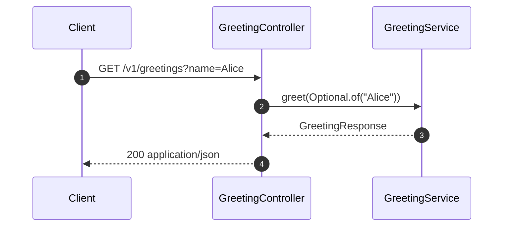
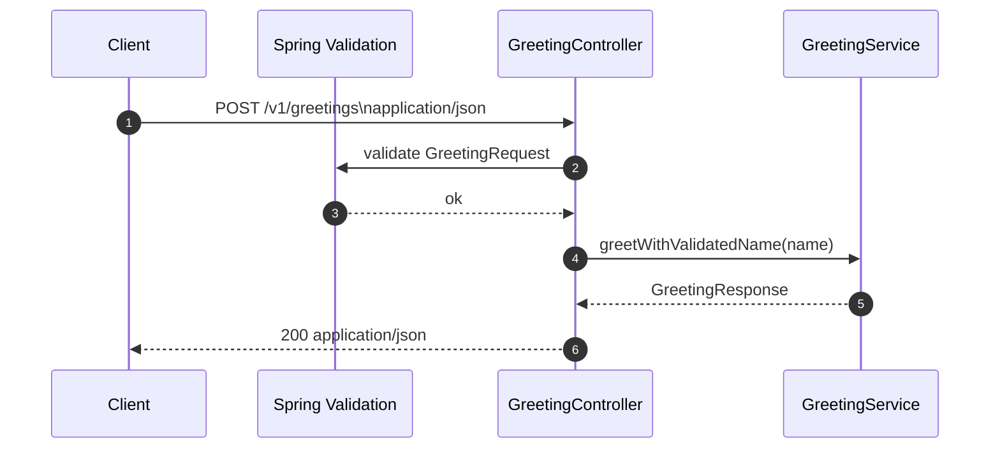
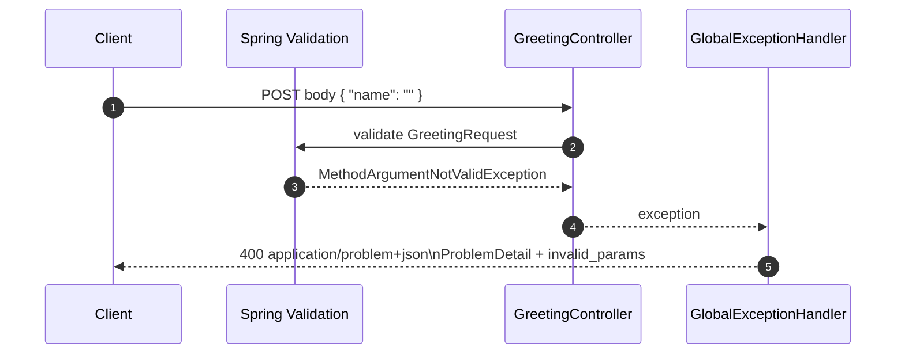

# Sequence diagrams

These diagrams describe the **runtime interactions** for the main HTTP flows. They complement the [C4 component view](c4-model.md) and the [feature design document](fdd-greeting-service.md).

---

## 1. GET `/v1/greetings` — success (optional name)

If `name` is missing or blank after trim, the service uses the configured default (see `greeting.default-name`).

---

## 2. POST `/v1/greetings` — success

Validation runs before the controller method body (`@Valid`).

---

## 3. POST `/v1/greetings` — validation error (400, RFC 7807)

The controller method is not invoked when validation fails; the **global exception handler** produces the **RFC 7807** response.

---

## 4. Observability (parallel concerns)

For every handled request, Spring MVC + Micrometer may create **observations** and tracing may populate **MDC** keys such as `traceId` and `spanId` for JSON logs. That behaviour is cross-cutting and not repeated on every sequence diagram above.
